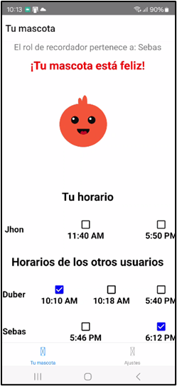
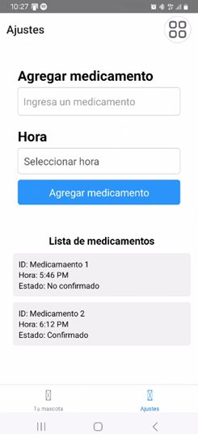
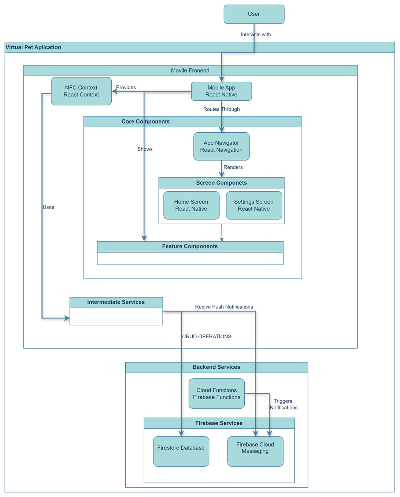

# Virtual Pet

**Mascota Saludable** is a mobile application designed to improve medication adherence in older adults through a collaborative and gamified approach. The app uses **React Native**, **Firebase**, and **NFC tags** to provide an accessible, interactive, and motivating experience, where users take care of a virtual pet that grows based on collective progress in medication confirmation and intake.

---
# Table of Contents
- [Virtual Pet](#virtual-pet)
- [Table of Contents](#table-of-contents)
- [1. Virtual Pet](#1-virtual-pet)
  - [1.1 📋 Key Features](#11--key-features)
  - [1.2 🖼️ screenshots](#12-️-screenshots)
    - [**HomeScreen**](#homescreen)
    - [**SettingsScreen**](#settingsscreen)
  - [1.3 🛠️ Technologies Used](#13-️-technologies-used)
- [2. Getting Started](#2-getting-started)
  - [Clone the Repository:](#clone-the-repository)
  - [Install Dependencies:](#install-dependencies)
  - [Set Up Firebase:](#set-up-firebase)
  - [Start the Metro Server](#start-the-metro-server)
  - [Start your Application](#start-your-application)
    - [For Android](#for-android)
    - [For iOS](#for-ios)
  - [Modifying your App](#modifying-your-app)
- [3. 📚 Technical Documentation](#3--technical-documentation)
- [🗂️ Project Structure](#️-project-structure)
  - [Modular diagram](#modular-diagram)
- [📝 Licence](#-licence)

---

# 1. Virtual Pet

This is a new [**React Native**](https://reactnative.dev) project, bootstrapped using [`@react-native-community/cli`](https://github.com/react-native-community/cli).

**Mascota Saludable** is a mobile application designed to improve medication adherence in older adults through a collaborative and gamified approach. The app uses **React Native**, **Firebase**, and **NFC tags** to provide an accessible, interactive, and motivating experience, where users take care of a virtual pet that grows based on collective progress in medication confirmation and intake.


## 1.1 📋 Key Features

1. **Medication Registration**: 
   - Add medications with specific schedules from the settings screen.
   - Real-time synchronization with Firebase.

2. **Medication Confirmation via NFC**:
   - Users confirm medication intake by tapping an assigned NFC tag.

3. **Virtual Pet Growth**:
   - The pet reflects collective progress in real-time, showing changes in state and growth.

4. **Automatic Daily Reset**:
   - Daily confirmations are reset at a defined time, keeping the daily cycles organized.

5. **Role Rotation**:
   - Users rotate roles, such as "reminder" roles, to promote group collaboration.

6. **Personalized Notifications**:
   - Local and group reminders integrated with Firebase Cloud Messaging and Notifee.

---

## 1.2 🖼️ screenshots

### **HomeScreen**


### **SettingsScreen**


---

## 1.3 🛠️ Technologies Used

- **React Native**: User interface development.
- **Firebase**:
  - Firestore Database: Real-time storage.
  - Firebase Cloud Functions: Backend automation.
  - Firebase Cloud Messaging: Notification management.
- **React Navigation**: Screen navigation.
- **react-native-nfc-manager**: NFC tag management.
- **Notifee**: Advanced notification handling.

---

# 2. Getting Started

>**Note**: Make sure you have completed the [React Native - Environment Setup](https://reactnative.dev/docs/environment-setup) instructions till "Creating a new application" step, before proceeding.

## Clone the Repository:

```bash
# Clone the Repository:
git clone https://github.com/tu-nombre-de-usuario/mascota-saludable.git
```

## Install Dependencies:

```bash
# Install Dependencies
npm install
```
- Navigate to the Project Directory:
```bash
cd VIRTUALPET
```

## Set Up Firebase:

To integrate Firebase services into your project, you need to configure some Firebase services. These settings can be found on the official Firebase site for react-native.

- Visit the React Native Firebase Documentation [React Native Firebase](https://rnfirebase.io) to configure Firebase services for your project.


## Start the Metro Server

First, you will need to start **Metro**, the JavaScript _bundler_ that ships _with_ React Native.

To start Metro, run the following command from the _root_ of your React Native project:

```bash
# using npm
npm start

# OR using Yarn
yarn start
```

## Start your Application

Let Metro Bundler run in its _own_ terminal. Open a _new_ terminal from the _root_ of your React Native project. Run the following command to start your _Android_ or _iOS_ app:

### For Android

```bash
# using npm
npm run android

# OR using Yarn
yarn android
```

### For iOS

```bash
# using npm
npm run ios

# OR using Yarn
yarn ios
```

If everything is set up _correctly_, you should see your new app running in your _Android Emulator_ or _iOS Simulator_ shortly provided you have set up your emulator/simulator correctly.

This is one way to run your app — you can also run it directly from within Android Studio and Xcode respectively.

## Modifying your App

Now that you have successfully run the app, let's modify it.

1. Open `App.tsx` or any file of the project in your text editor of choice and edit some lines.
2. For **Android**: Press the <kbd>R</kbd> key twice or select **"Reload"** from the **Developer Menu** (<kbd>Ctrl</kbd> + <kbd>M</kbd> (on Window and Linux) or <kbd>Cmd ⌘</kbd> + <kbd>M</kbd> (on macOS)) to see your changes!

   For **iOS**: Hit <kbd>Cmd ⌘</kbd> + <kbd>R</kbd> in your iOS Simulator to reload the app and see your changes!

# 3. 📚 Technical Documentation
The Mascota Saludable project integrates several custom hooks and services to ensure seamless functionality and interaction between the frontend, backend, and services. Below is a detailed overview of the key technical components:

- **User ID Service (Custom Hook)**: 
  - Manages the unique identifier (ID) for each user in the system.
  - This ID is essential for linking user data in Firebase, including medication confirmations and role assignments.
  - Ensures each user has their own dedicated space in the database and facilitates synchronization of their data across devices.

- **NFC Service (react-native-nfc-manager)**
  - Uses the react-native-nfc-manager library to handle interactions with NFC tags.
  - Detects NFC tags, reads their content, and records events related to medication confirmation.
  - Plays a crucial role in enabling tangible interactions for medication tracking.
- **Pet Growth Service (Custom Hook)**
  - Manages the logic for the growth of the virtual pet.
  - Evaluates the daily confirmations from all users and updates the pet's status in Firebase.
  - Handles progression rules, including stage transitions and emotional states, depending on collective success.
- **Medication Service (Custom Hook)**
  - Administers the configuration and management of medications.
  - Allows users to register new medications and retrieve medication details from Firestore.
  - Integrates with the notification service to provide reminders and updates for medication schedules.
- **Update Medication Service (Custom Hook)**
  - Manages the real-time update of medication statuses, including confirming whether medications have been taken.
  - Uses Firestore for synchronization, ensuring the information is accurate and up-to-date across all user devices.
- **Daily Validation Service (Custom Hook)**
  - Validates daily confirmations to determine if all users have registered their medication intake.
  - Outputs results used by other services, such as the Pet Growth Service, to determine the pet's progress.
  - Manages the daily reset of confirmations, ensuring they are automatically cleared at the configured time.
- **Role Management (Custom Hook)**
  - Assigns and rotates user roles daily, such as the "reminder" role responsible for sending notifications to other users.
  - Encourages collaboration among participants by evenly distributing responsibilities.
  - Stores role information in Firestore and synchronizes it in real-time across all devices.
- **Notification Service (React Native)**
  - Handles notifications for users, including both local reminders and group notifications.
  - For notifications triggered by other users, Firebase Cloud Messaging and the Notifee library are used to send updates on the pet's progress and reminders from the designated "reminder" user.
  - Local notifications for medication reminders rely solely on the Notifee library.


# 🗂️ Project Structure
Inside the project folder you can fin the src folder which contains all the conponets and neccesary logic. 

```paintext
src/
├── components/      # Reusable visual components
├── context/         # React contexts for global state management
├── services/        # Custom hooks and services (e.g., DailyValidation, RoleManagement)
├── screens/         # Main screens (HomeScreen, SettingsScreen)
├── firebase/        # Firebase logic handlers
└── App.tsx          # Application entry point

```
## Modular diagram
The Modular System Structure describes the organization of the main components of the Healthy Pet application, as well as the interactions between them to ensure its cohesive functioning. The Healthy Pet system was designed under a modular approach to ensure greater flexibility, scalability and maintainability. Each module of the system fulfills a specific function, ensuring a separation between logic, user interaction and Backend operations and functions.

The system is organized into three main components:

**Mobile Frontend:** Developed in React Native, it provides a friendly and accessible interface for users. The main screens include the ``"HomeScreen"`` where the virtual pet and users' progress is displayed, and the ``"SettingsScreen"`` where medications and schedules are configured. 

**Backend Services:** Implemented through Firebase, including Firestore for real-time storage, and Cloud Functions in conjunction with Firebase Cloud Messages for handling the different notifications present in the application.

**Intermediate services:** Custom hooks and utilities built with React Native that manage system logic, such as "useMedManagement" which handles all medication-related management and "useUpdateMedicationStatus" for medication confirmations by users.



# 📝 Licence
This project is licensed under the MIT License.


